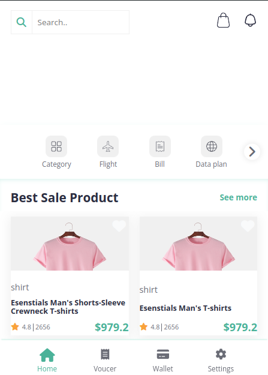
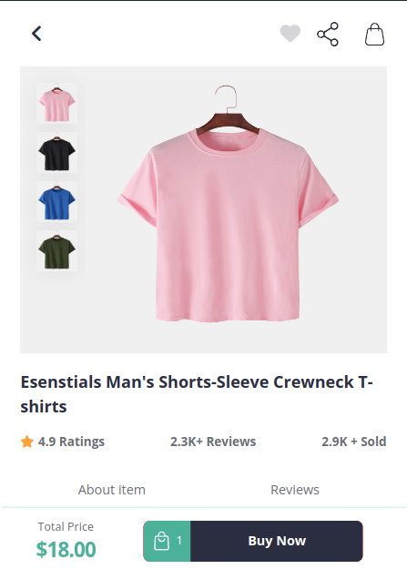
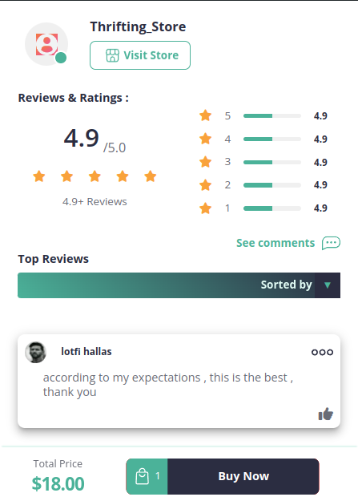

<!-- @format -->

# E-commerce website template





## Usage

### 1. Clone the Repository

Start by cloning the repository to your local machine:

```bash
git clone https://github.com/lotfi-1/example-of-ecommerce-template.git
cd ecommerce-dashboard
npm install
npm start
```

- PORT : 5000

## Features

- Html
- css
- javascript
